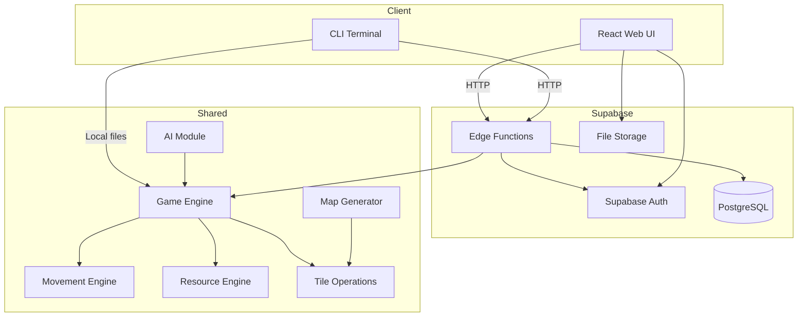
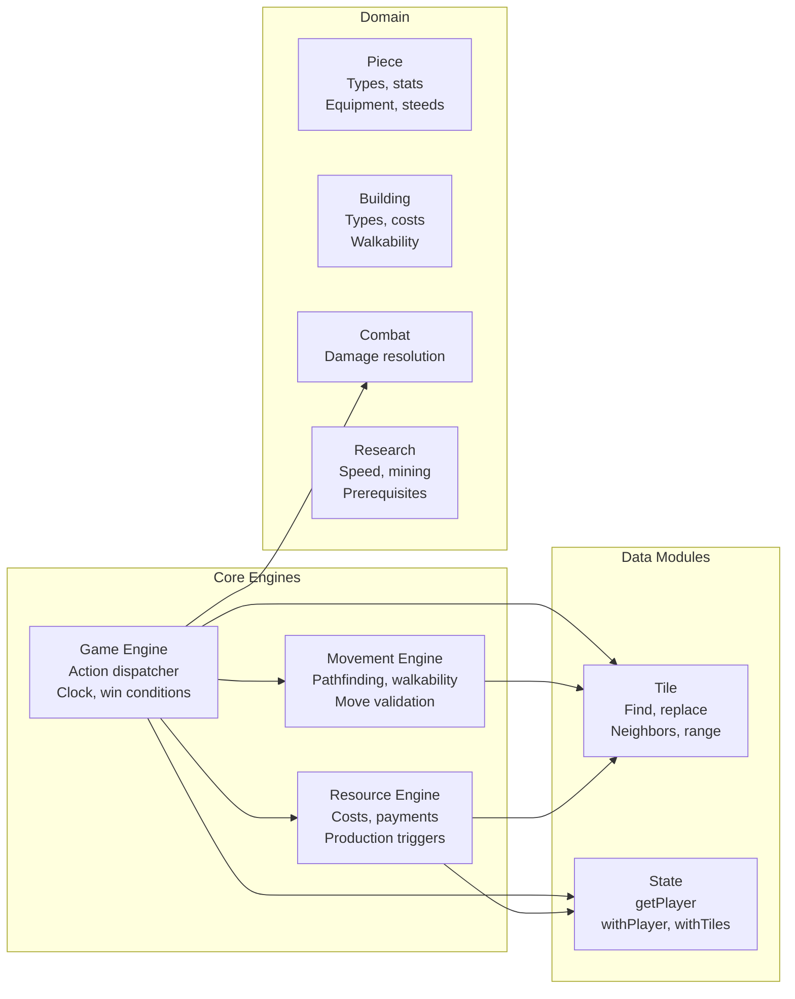
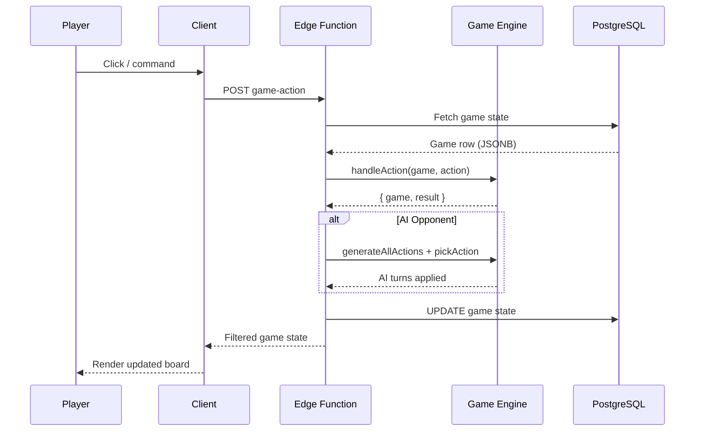
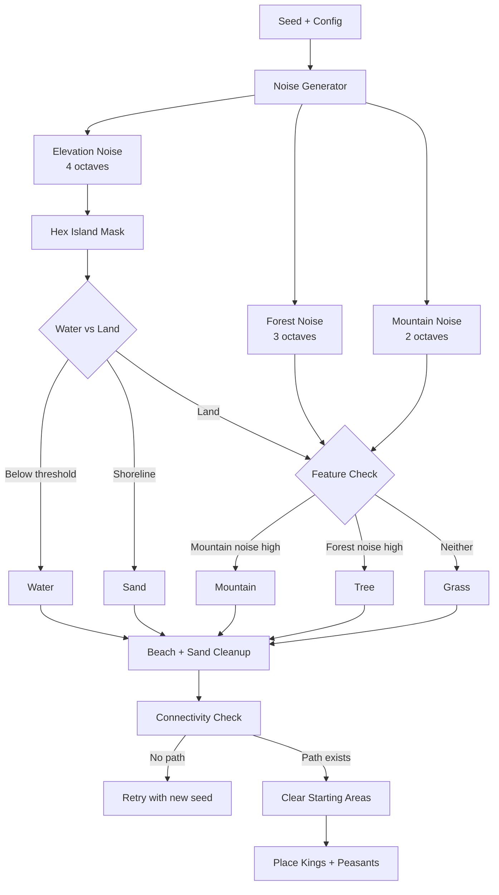
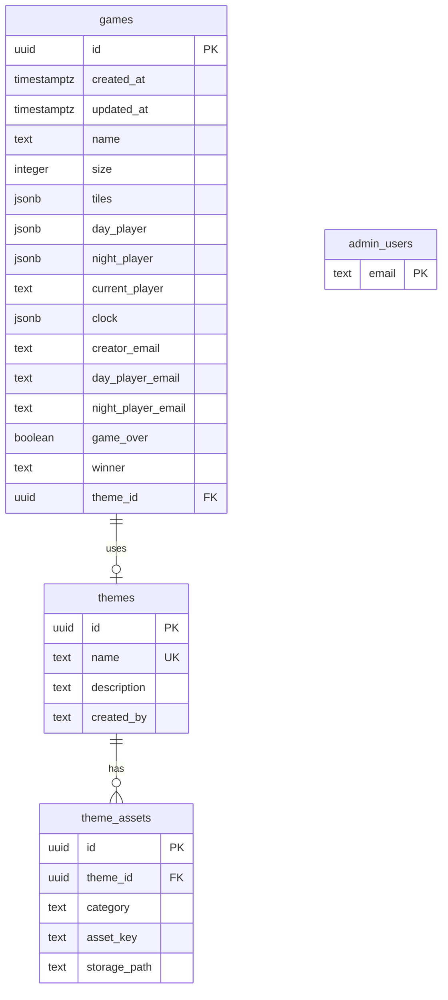
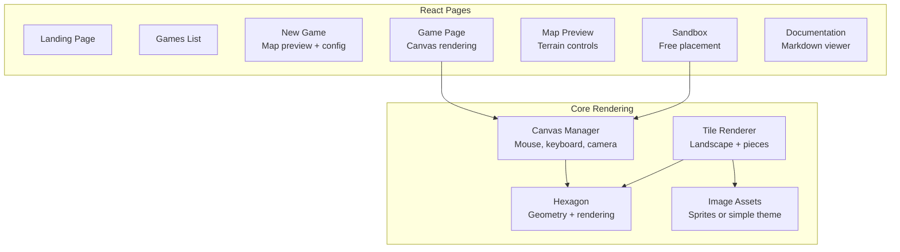
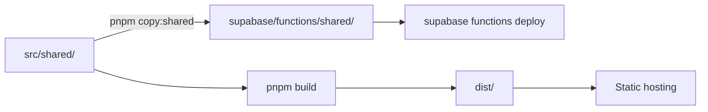

# Architecture

## System Overview

## Module Architecture

The shared game logic is organized into focused modules with clear responsibilities:

## Data Flow

### Game Action Flow

### Map Generation Flow

## Database Schema

## Client Architecture

## Deployment

