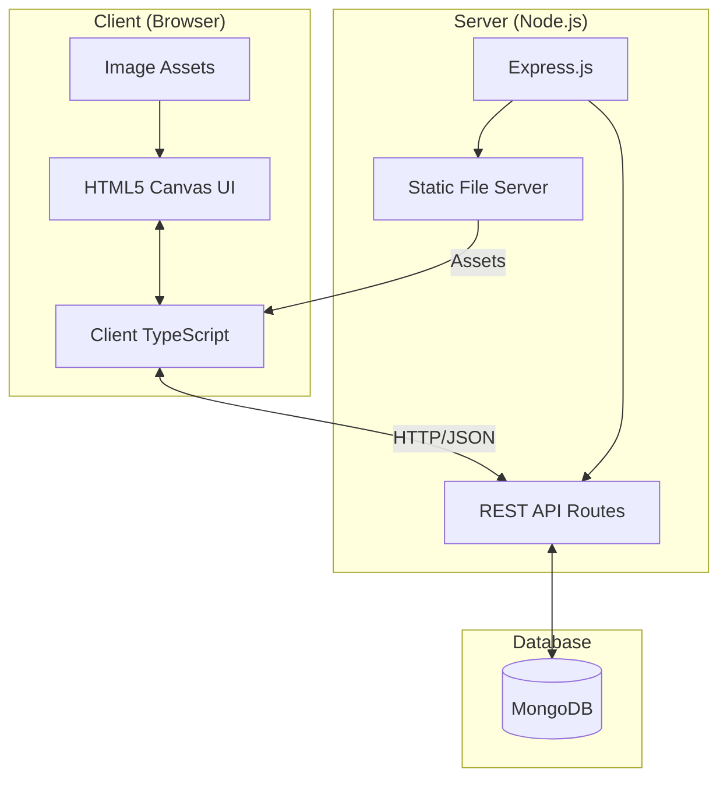
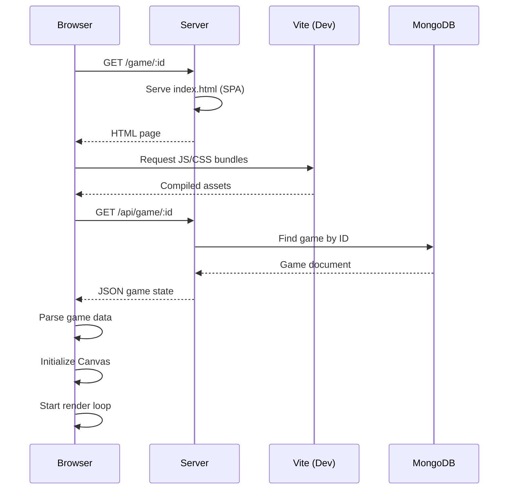
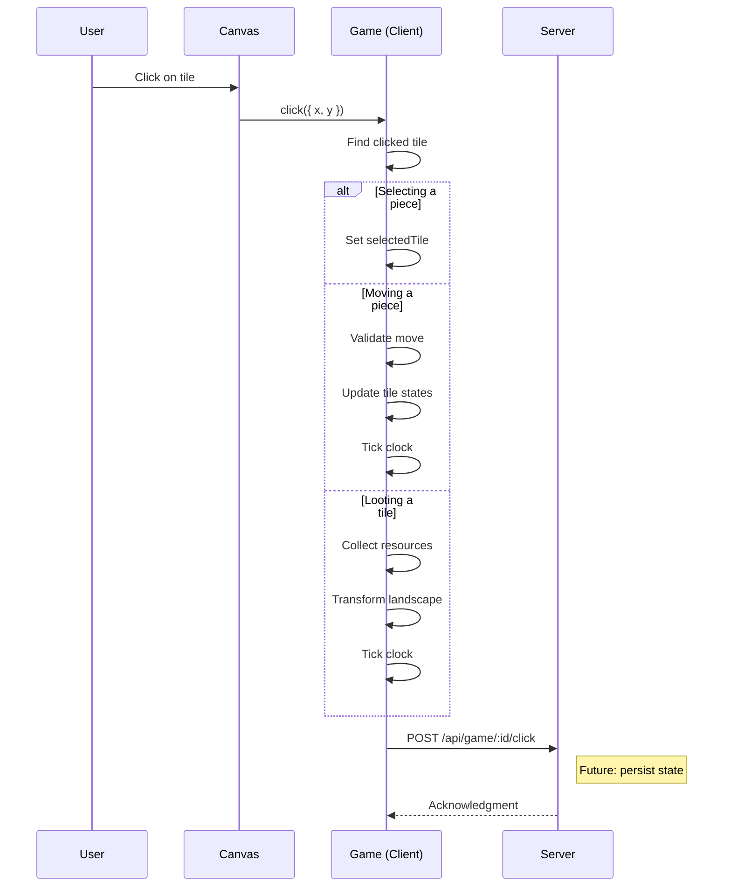
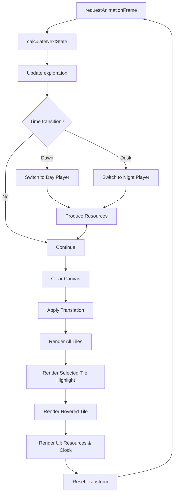
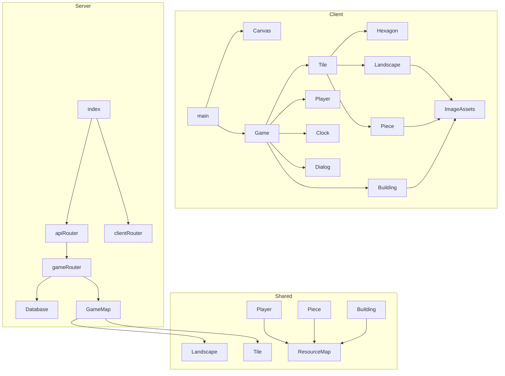
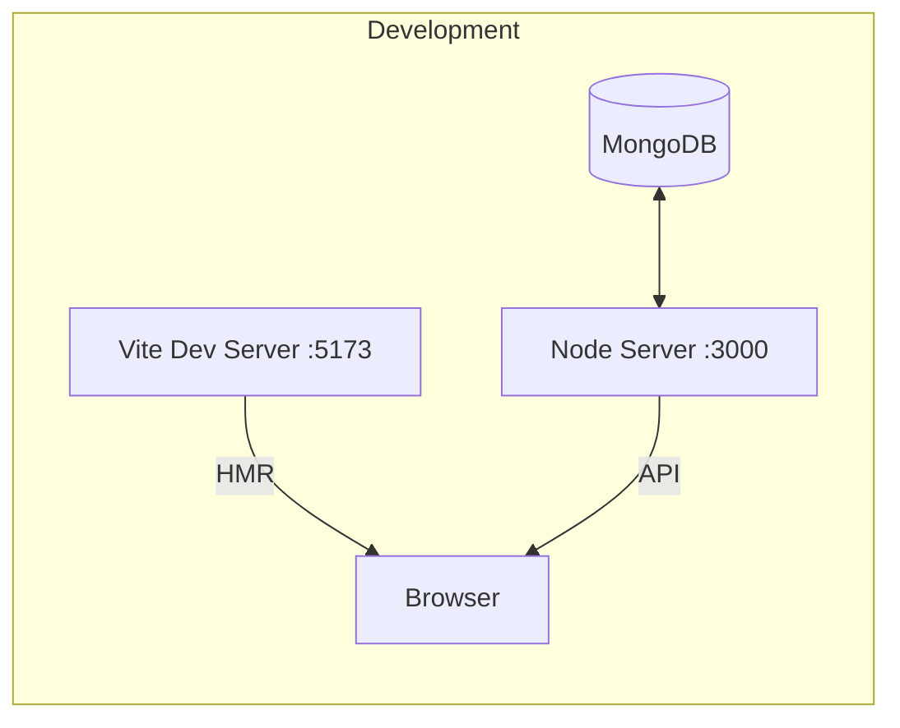
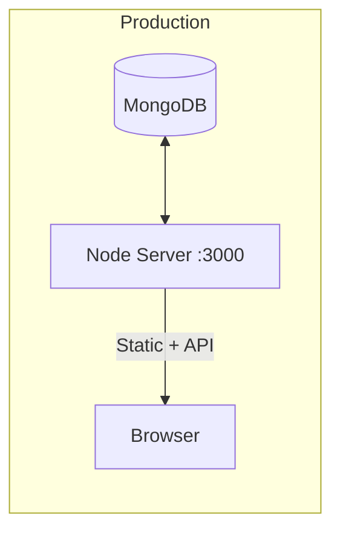
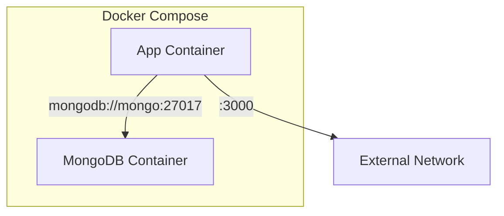

# System Architecture

This document provides an overview of the Heroes of Fright and Panic system architecture.

## High-Level Architecture



## Project Structure

```
heroes-of-fright-and-panic/
├── src/
│   ├── client/                 # Frontend application
│   │   ├── assets/             # Game images (sprites)
│   │   ├── core/               # Core game classes
│   │   │   ├── Board.ts        # Main game controller
│   │   │   ├── Building.ts     # Building class + rendering
│   │   │   ├── Clock.ts        # Day/night cycle
│   │   │   ├── Dialog.ts       # UI dialogs
│   │   │   ├── GameImage.ts    # Image loader helper
│   │   │   ├── Hexagon.ts      # Hexagon math & rendering
│   │   │   ├── Landscape.ts    # Terrain class + rendering
│   │   │   ├── Piece.ts        # Unit class + rendering
│   │   │   ├── Player.ts       # Player class
│   │   │   ├── ResourceMap.ts  # Resource handling + UI
│   │   │   └── Tile.ts         # Tile class + rendering
│   │   ├── images/             # Image asset exports
│   │   ├── types/              # TypeScript type definitions
│   │   ├── utils/              # Utility functions
│   │   ├── canvas.ts           # Canvas wrapper class
│   │   ├── main.ts             # Entry point
│   │   └── style.css           # Styles
│   │
│   ├── server/                 # Backend application
│   │   ├── api/                # API routes
│   │   │   ├── game/           # Game-specific routes
│   │   │   └── router.ts       # Main API router
│   │   ├── client/             # HTML templates
│   │   │   ├── create.html     # Game creation page
│   │   │   ├── index.html      # Landing page
│   │   │   └── router.ts       # Client routes
│   │   ├── database/           # Database layer
│   │   │   └── index.ts        # MongoDB connection & models
│   │   └── index.ts            # Server entry point
│   │
│   └── shared/                 # Shared between client/server
│       ├── building/           # Building type definitions
│       ├── map/                # Map & tile logic
│       │   ├── landscape.ts    # Landscape generation
│       │   ├── map.ts          # Map utilities
│       │   └── tile.ts         # Tile type definition
│       ├── piece/              # Piece type definitions
│       ├── player/             # Player & resource types
│       └── utils/              # Shared utilities
│
├── static/                     # Server static assets
│   └── img/                    # Game images (served)
│
├── documentation/              # Project documentation
│
└── [config files]              # TypeScript, Docker, etc.
```

## Request Flow

### Page Load



### Game Action



## Rendering Pipeline



## Module Dependencies



## Development vs Production

### Development Mode



**Commands:**
- `pnpm dev` - Run both client (Vite watch) and server (tsx watch)
- `pnpm dev:container` - Run in Docker with hot reload

### Production Mode



**Commands:**
- `pnpm build` - Build client and server
- `pnpm start` - Run production server

## Docker Configuration



### Services

| Service | Image | Port | Purpose |
|---------|-------|------|---------|
| `app` | Custom (Dockerfile) | 3000 | Game server |
| `mongo` | mongo:7 | 27017 | Database |

## Environment Variables

| Variable | Description | Default |
|----------|-------------|---------|
| `PORT` | Server port | 3000 |
| `MONGODB_URI` | MongoDB connection string | Required |
