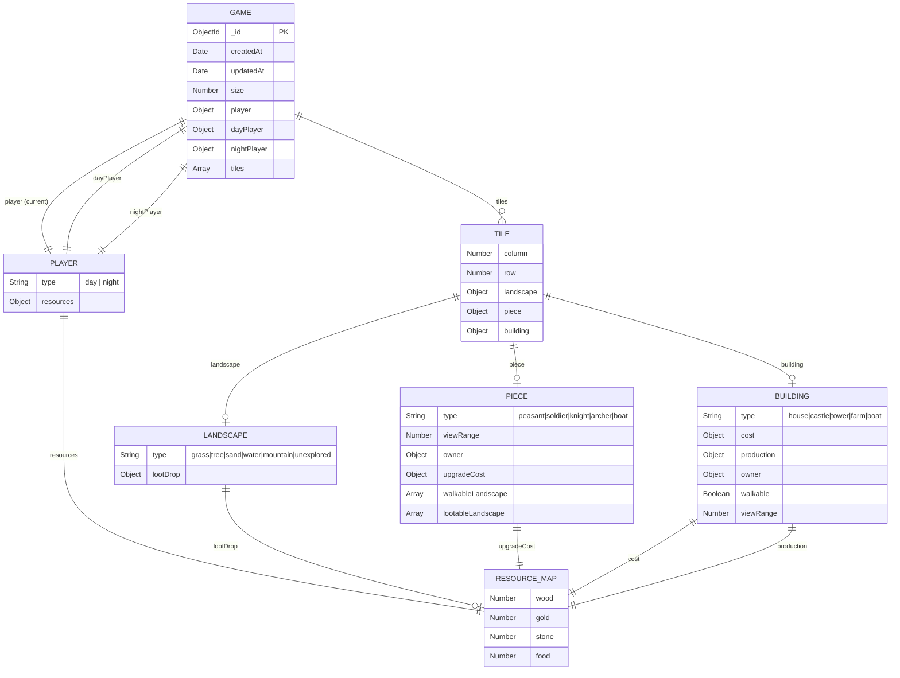
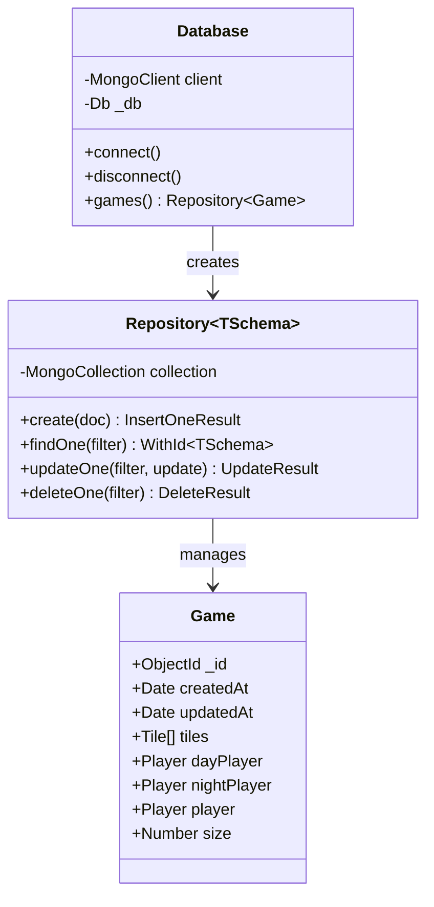
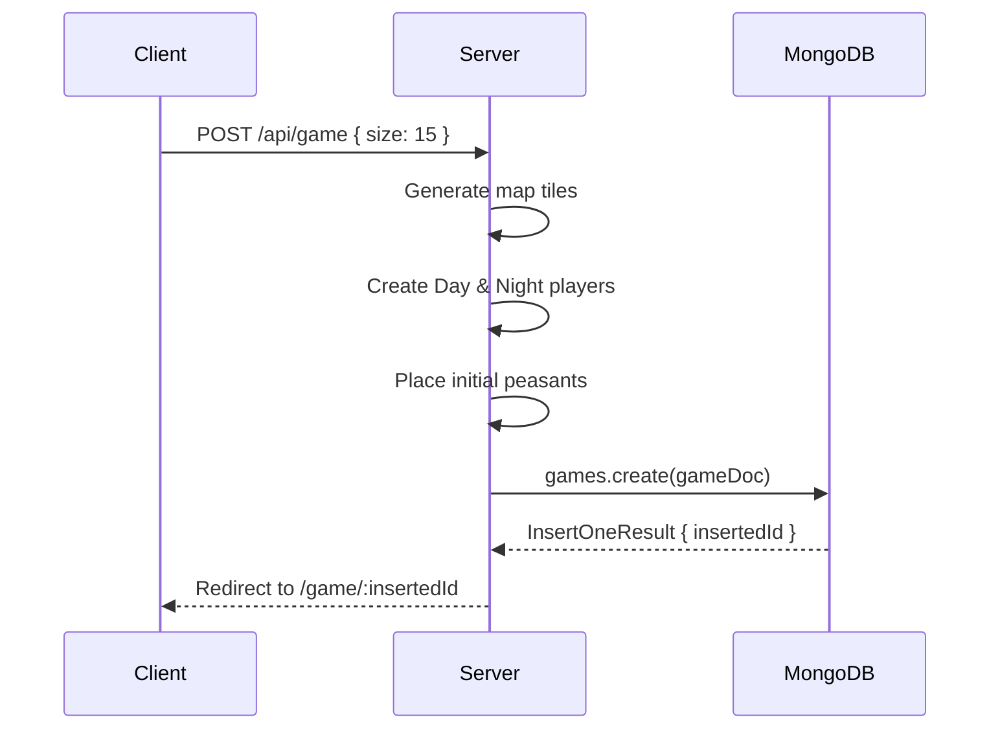
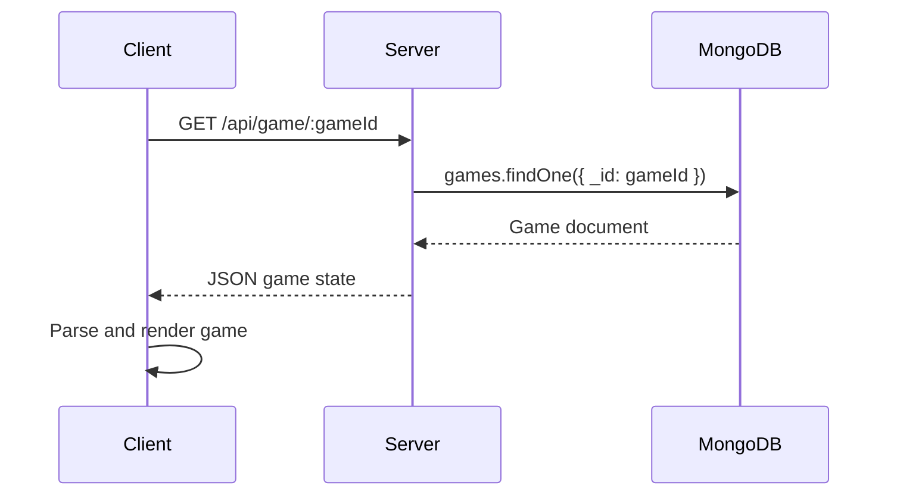

# Database Structure

Heroes of Fright and Panic uses **MongoDB** as its database. This document describes the database schema and data structures.

## Database Configuration

- **Database Name**: `forest-game`
- **Connection**: Configured via `MONGODB_URI` environment variable

## Collections

### `games` Collection

The main collection storing game state.



## Document Schema

### Game Document

```typescript
interface Game {
  _id?: ObjectId; // MongoDB auto-generated ID
  createdAt: Date; // Game creation timestamp
  updatedAt: Date; // Last update timestamp
  size: number; // Map size (size × size grid)
  player: Player; // Reference to current active player
  dayPlayer: Player; // Day player state
  nightPlayer: Player; // Night player state
  tiles: Tile[]; // Array of all map tiles
}
```

### Player Subdocument

```typescript
interface Player {
  type: "day" | "night"; // Player faction
  resources: ResourceMap; // Player's resource inventory
}
```

### ResourceMap Subdocument

```typescript
interface ResourceMap {
  wood: number; // Wood resource count
  gold: number; // Gold resource count
  stone: number; // Stone resource count
  food: number; // Food resource count
}
```

### Tile Subdocument

```typescript
interface Tile {
  column: number; // X coordinate in grid
  row: number; // Y coordinate in grid
  landscape: Landscape | null; // Terrain type
  piece: Piece | null; // Unit on this tile (if any)
  building: Building | null; // Structure on this tile (if any)
}
```

### Landscape Subdocument

```typescript
interface Landscape {
  type: LandscapeType; // "grass" | "tree" | "sand" | "water" | "mountain" | "unexplored"
  lootDrop?: ResourceMap; // Resources gained when looted
}
```

### Piece Subdocument

```typescript
interface Piece {
  type: PieceType; // "peasant" | "soldier" | "knight" | "archer" | "boat"
  viewRange: number; // Vision radius
  owner: Player; // Reference to owning player
  upgradeCost: ResourceMap; // Cost to upgrade this piece
  walkableLandscape: LandscapeType[]; // Terrain types this piece can traverse
  lootableLandscape: LandscapeType[]; // Terrain types this piece can harvest
}
```

### Building Subdocument

```typescript
interface Building {
  type: BuildingType; // "house" | "castle" | "tower" | "farm" | "boat"
  cost: ResourceMap; // Construction cost
  production: ResourceMap; // Resources produced per turn
  owner: Player; // Reference to owning player
  walkable: boolean; // Whether units can enter
  viewRange: number; // Vision radius
}
```

## Example Document

```json
{
  "_id": "507f1f77bcf86cd799439011",
  "createdAt": "2024-01-15T10:30:00.000Z",
  "updatedAt": "2024-01-15T11:45:00.000Z",
  "size": 15,
  "player": {
    "type": "day",
    "resources": {
      "wood": 5,
      "gold": 0,
      "stone": 2,
      "food": 3
    }
  },
  "dayPlayer": {
    "type": "day",
    "resources": {
      "wood": 5,
      "gold": 0,
      "stone": 2,
      "food": 3
    }
  },
  "nightPlayer": {
    "type": "night",
    "resources": {
      "wood": 3,
      "gold": 0,
      "stone": 1,
      "food": 2
    }
  },
  "tiles": [
    {
      "row": 0,
      "column": 0,
      "landscape": {
        "type": "grass"
      },
      "piece": null,
      "building": null
    },
    {
      "row": 0,
      "column": 1,
      "landscape": {
        "type": "tree",
        "lootDrop": {
          "wood": 1,
          "gold": 0,
          "stone": 0,
          "food": 0
        }
      },
      "piece": {
        "type": "peasant",
        "viewRange": 1,
        "owner": {
          "type": "day",
          "resources": { "wood": 5, "gold": 0, "stone": 2, "food": 3 }
        },
        "upgradeCost": { "wood": 1, "gold": 0, "stone": 0, "food": 0 },
        "walkableLandscape": ["grass", "sand"],
        "lootableLandscape": ["tree", "mountain"]
      },
      "building": {
        "type": "house",
        "cost": { "wood": 2, "gold": 0, "stone": 0, "food": 0 },
        "production": { "wood": 0, "gold": 0, "stone": 0, "food": 1 },
        "owner": {
          "type": "day",
          "resources": { "wood": 5, "gold": 0, "stone": 2, "food": 3 }
        },
        "walkable": true,
        "viewRange": 1
      }
    }
  ]
}
```

## Repository Pattern

The database access is abstracted through a generic `Repository` class:



## API Endpoints

| Method | Endpoint                  | Description            |
| ------ | ------------------------- | ---------------------- |
| `POST` | `/api/game`               | Create a new game      |
| `GET`  | `/api/game/:gameId`       | Retrieve game state    |
| `POST` | `/api/game/:gameId/click` | Process a click action |

### Create Game Flow



### Load Game Flow


