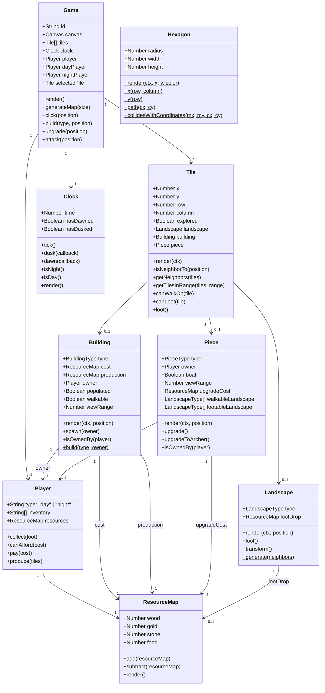
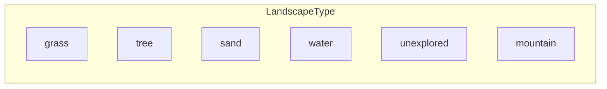
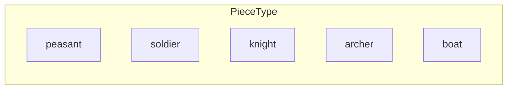
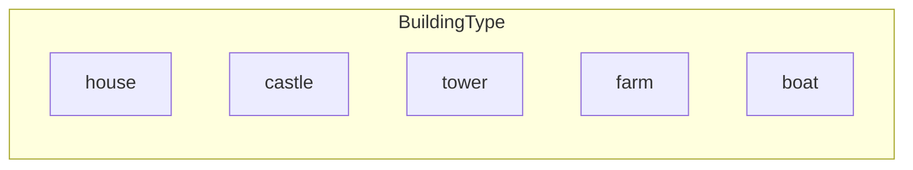
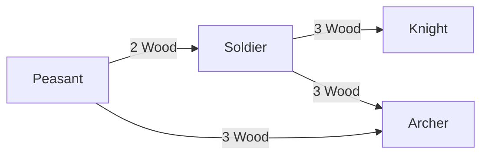
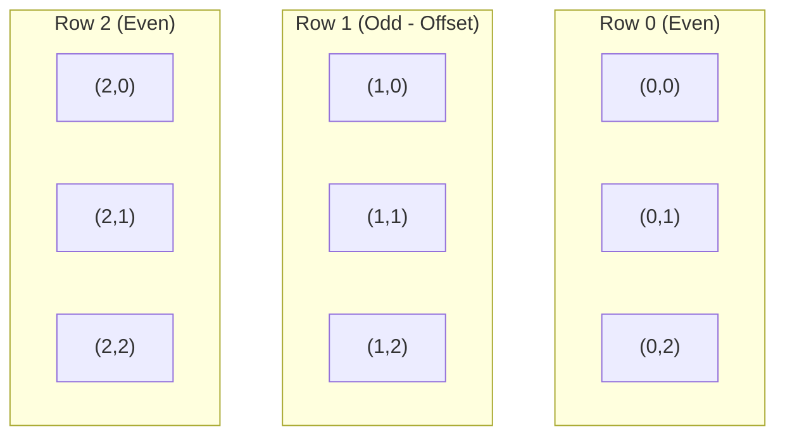
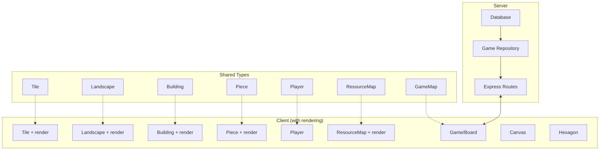

# Game Data Classes

This document describes the core data classes and their relationships in Dusk and Dawn.

## Class Diagram

## Enumerations

### LandscapeType

| Type         | Walkable          | Lootable | Loot Drop |
| ------------ | ----------------- | -------- | --------- |
| `grass`      | ✅                | ❌       | -         |
| `tree`       | ❌ (Archers only) | ✅       | 1 Wood    |
| `sand`       | ✅                | ❌       | -         |
| `water`      | ❌                | ❌       | -         |
| `mountain`   | ❌                | ✅       | 1 Stone   |
| `unexplored` | -                 | -        | -         |

### PieceType

| Type      | View Range | Walkable Terrain  | Can Loot       | Upgrade Cost |
| --------- | ---------- | ----------------- | -------------- | ------------ |
| `peasant` | 1          | grass, sand       | tree, mountain | 1 Wood       |
| `soldier` | 1          | grass, sand       | ❌             | 2 Wood       |
| `knight`  | 2          | grass, sand       | ❌             | 3 Wood       |
| `archer`  | 2          | grass, tree, sand | ❌             | 3 Wood       |
| `boat`    | -          | -                 | -              | -            |

### BuildingType

| Type     | Cost              | Production | View Range | Can Spawn |
| -------- | ----------------- | ---------- | ---------- | --------- |
| `house`  | 2 Wood            | 1 Food     | 1          | Peasant   |
| `castle` | 10 Wood, 10 Stone | -          | 3          | ❌        |
| `tower`  | 1 Wood, 3 Stone   | -          | 4          | ❌        |
| `farm`   | 1 Wood            | 1 Food     | 1          | ❌        |
| `boat`   | Free              | 1 Food     | 1          | ❌        |

## Unit Upgrade Path

## Tile Coordinate System

The game uses a hexagonal offset coordinate system where:

- Tiles are identified by `(row, column)`
- Even rows are aligned to the left
- Odd rows are offset by half a hexagon width

### Neighbor Directions

Each hexagon has 6 neighbors:

- **East** / **West** (same row)
- **North-East** / **North-West** (row - 1)
- **South-East** / **South-West** (row + 1)

The column offset depends on whether the row is even or odd.

## Client vs Server Classes

The codebase has parallel implementations for client and server:

