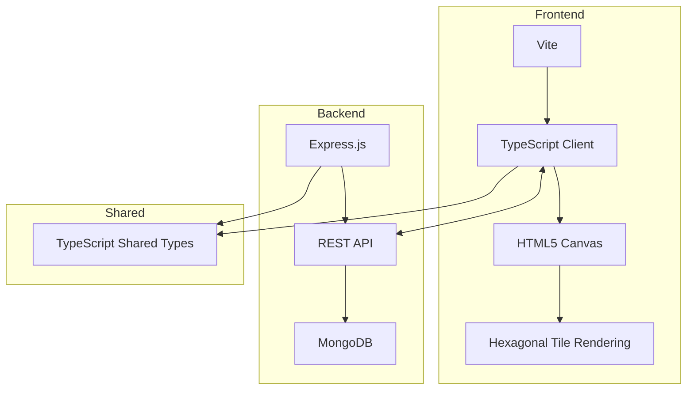
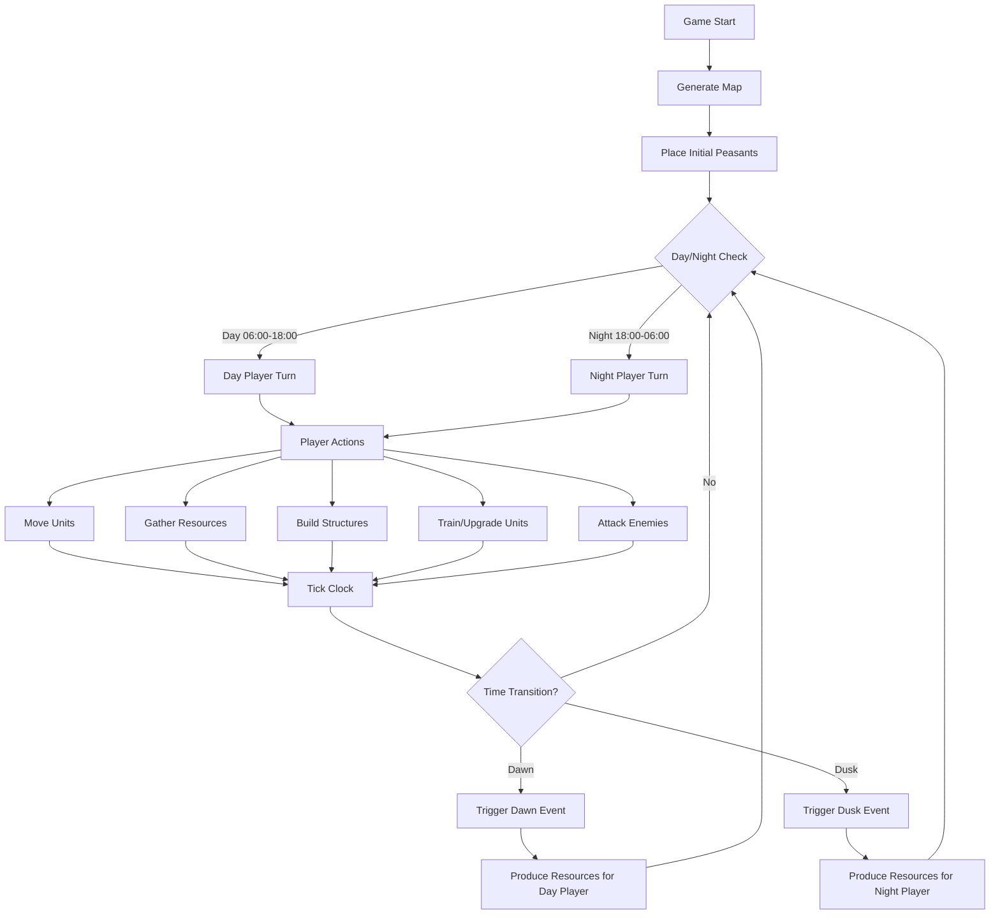
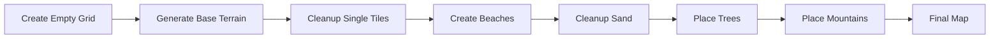
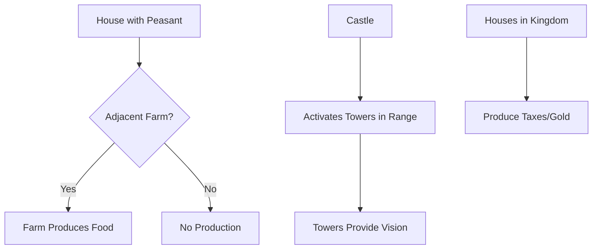

# Heroes of Fright and Panic - Game Documentation

## Overview

**Heroes of Fright and Panic** (also referred to as "Tower Game" or "Forest Game") is a turn-based strategy game featuring two opposing players who take turns based on a day/night cycle. The game is played on a procedurally generated hexagonal tile map where players gather resources, build structures, train units, and compete for territory control.

## Core Concept

> "Defend your house in the woods"

The game pits a **Day Player** against a **Night Player**. Each player controls their units during their respective time periods:

- **Day (06:00 - 18:00)**: Day player is active
- **Night (18:00 - 06:00)**: Night player is active

## Technology Stack

## Game Flow

## Game Map

The map consists of hexagonal tiles arranged in a grid. Each tile can contain:

- A **Landscape** (terrain type)
- A **Building** (optional)
- A **Piece/Unit** (optional)

### Map Generation Pipeline

## Resources

Players manage four types of resources:

| Resource     | Source                      | Usage                                   |
| ------------ | --------------------------- | --------------------------------------- |
| 🪵 **Wood**  | Trees (looting)             | Building construction, unit upgrades    |
| 🪨 **Stone** | Mountains (looting)         | Building construction (castles, towers) |
| 🪙 **Gold**  | Houses (taxes from kingdom) | Future mechanics                        |
| 🍖 **Food**  | Farms (production)          | Future mechanics                        |

### Resource Production

## Keyboard Controls

| Key          | Action            |
| ------------ | ----------------- |
| `Arrow Keys` | Pan the camera    |
| `H`          | Build House       |
| `T`          | Build Tower       |
| `C`          | Build Castle      |
| `B`          | Build Boat        |
| `F`          | Build Farm        |
| `P`          | Create Peasant    |
| `U`          | Upgrade Unit      |
| `A`          | Upgrade to Archer |
| `X`          | Attack            |

## Future Ideas (from ideas.md)

- All towers within range of castle get activated
- All houses within kingdom activation area produce taxes (gold)
- Unit upgrade path: Peasant → Knight → Paladin
  - One hit reduces Knight to Peasant
- Soldiers can also upgrade to Archer
