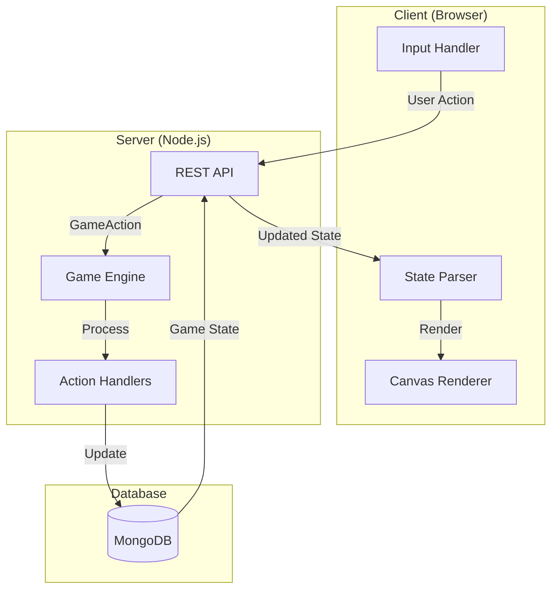
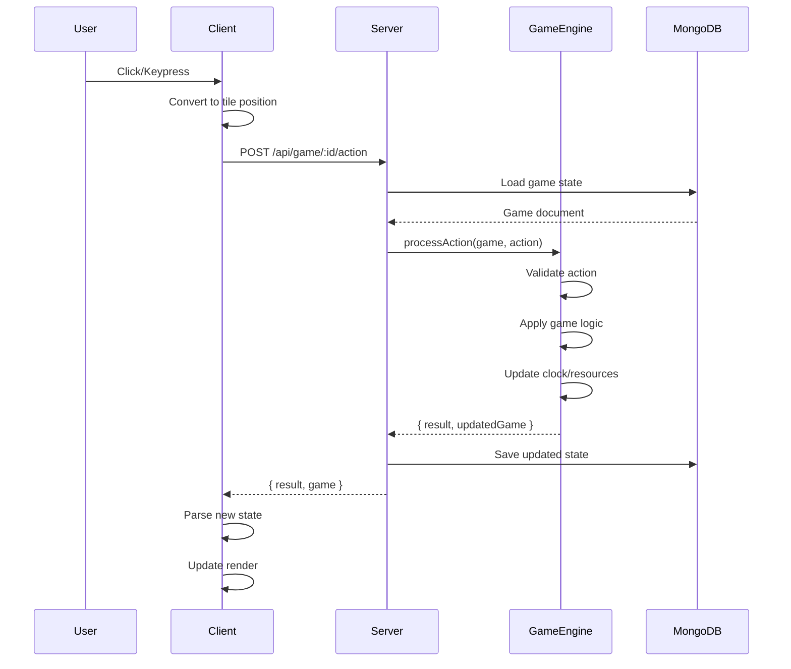

# Refactoring Plan: Server-Authoritative Architecture

## ✅ Status: COMPLETED

This document describes the refactoring from a client-heavy architecture to a **server-authoritative architecture**.

## Summary of Changes

### Architecture Overview



## Implementation Decisions

| Question | Decision |
|----------|----------|
| Communication | **Request-Response** - Each action returns updated game state |
| Selected Tile | **Client-side** - Client tracks selection, sends with actions |
| Time System | **Action-based** - Each action advances time by 1 hour |
| Player Identity | **Request body** - Player type sent with each action |
| Fog of War | **Client-filtered** - Server sends all tiles, client applies fog |
| Response Size | **Full state** - Every action returns complete game state |

## Files Created

| File | Purpose |
|------|---------|
| `src/shared/actions/index.ts` | Action type definitions shared between client/server |
| `src/server/game/engine.ts` | Main game logic engine |
| `src/server/game/actions.ts` | Action dispatch and handlers |

## Files Modified

| File | Changes |
|------|---------|
| `src/server/database/index.ts` | Added `GameClock` interface, updated `Game` schema |
| `src/server/api/game/router.ts` | Added `/action` endpoint, starting resources |
| `src/client/core/Board.ts` | Removed game logic, added API calls |
| `src/client/core/Clock.ts` | Simplified to display-only |
| `src/client/core/Player.ts` | Simplified, removed `produce()` method |
| `src/client/core/Building.ts` | Removed game logic, keep rendering only |
| `src/client/core/Piece.ts` | Removed game logic, keep rendering only |
| `src/client/core/Landscape.ts` | Removed map generation, keep rendering only |
| `src/client/core/Tile.ts` | Removed `loot()` and `walkable()` methods |
| `src/client/main.ts` | Simplified game loop |

## New API Endpoint

### POST `/api/game/:gameId/action`

Process a game action and return updated state.

**Request Body:**
```typescript
interface GameAction {
  type: "click" | "build" | "createPeasant" | "upgrade" | "attack";
  player: "day" | "night";
  position?: { row: number; column: number };
  selectedPosition?: { row: number; column: number };
  buildingType?: BuildingType;  // for "build" action
  targetType?: PieceType;       // for "upgrade" action (e.g., archer)
}
```

**Response:**
```typescript
interface ActionResponse {
  result: {
    success: boolean;
    error?: string;
    message?: string;
  };
  game: GameState;  // Full updated game state
}
```

## Data Flow



## Client Simplification

### Before (Game Logic on Client)
```typescript
// Client handled all game logic
click(position) {
  if (canMove()) { move(); }
  if (canLoot()) { loot(); player.collect(); }
  clock.tick();
}
```

### After (Render Only)
```typescript
// Client just sends actions and renders
async click(position) {
  const response = await fetch('/api/game/:id/action', {
    method: 'POST',
    body: JSON.stringify({
      type: 'click',
      player: this.currentPlayer,
      position,
      selectedPosition
    })
  });
  const { game } = await response.json();
  this.parse(game);  // Update local state for rendering
}
```

## Server Game Engine

The `GameEngine` class (`src/server/game/engine.ts`) handles all game logic:

- **Time Management**: `tick()`, `isDay()`, `isNight()`, `onDawn()`, `onDusk()`
- **Resource Management**: `produceResources()`, `canAfford()`, `addResources()`, `subtractResources()`
- **Tile Operations**: `findTile()`, `getNeighbors()`, `replaceTile()`, `getTilesInRange()`
- **Action Handlers**:
  - `handleClick()` - Select, move, loot
  - `handleBuild()` - Construct buildings
  - `handleCreatePeasant()` - Spawn peasants
  - `handleUpgrade()` - Upgrade units
  - `handleAttack()` - Combat

## Database Schema Updates

```typescript
interface Game {
  _id: ObjectId;
  createdAt: Date;
  updatedAt: Date;
  size: number;
  tiles: Tile[];
  dayPlayer: Player;
  nightPlayer: Player;
  currentPlayer: "day" | "night";  // NEW: Whose turn
  clock: {                          // NEW: Game time
    time: number;
    hasDawned: boolean;
    hasDusked: boolean;
  };
}
```

## Testing

To test the refactoring:

1. Start the server: `pnpm dev`
2. Create a new game at `/create`
3. Verify actions work:
   - Click to select/move pieces
   - Press `H` to build house
   - Press `P` to create peasant
   - Press `U` to upgrade
   - Watch clock advance with actions
